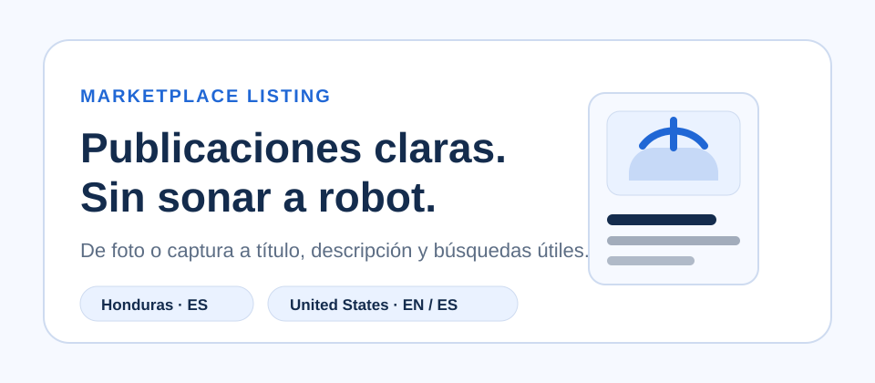
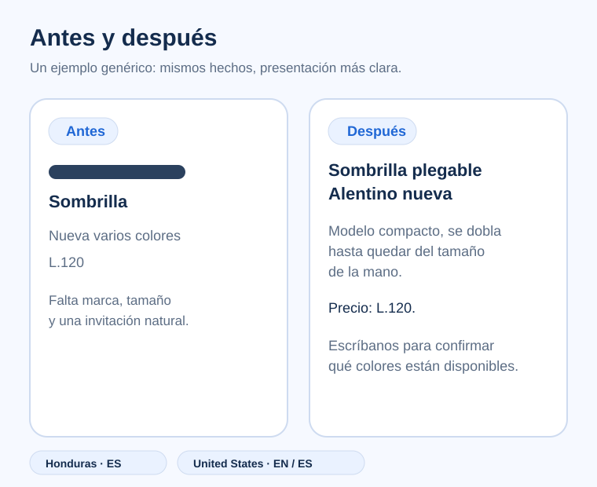

# Marketplace Listing

Publicaciones claras para personas que solo tienen una foto, una captura o el texto que ya usaron.

## Antes y después



## Cómo funciona

1. Suba la foto o captura y pegue el texto actual.
2. Reciba cambios concretos y una versión natural.
3. Copie el título, la descripción y los términos de búsqueda.

## Mercados

### Honduras

Responde en español claro y cordial, conserva precios en lempiras y respeta datos locales de entrega, pago y cobertura cuando usted los proporciona. Si existe un `datos-tienda.md` local con un bloque público aprobado, ese bloque se reutiliza literalmente en cada descripción de Honduras.

### United States

Responde en inglés natural de Estados Unidos por defecto. Usted puede solicitar español manteniendo el contexto de Estados Unidos: dólares, pickup, shipping, ciudad, condición y demás datos suministrados. No inserta texto de tienda de Honduras en publicaciones de Estados Unidos.

## Ejemplo real

Estos ejemplos muestran cómo conservar los datos del producto y presentarlos con una voz más natural, directa y fácil de copiar.

Honduras, ejemplo representativo con sombrilla Alentino:

```text
Título mejorado
Sombrilla plegable Alentino nueva, compacta, varios colores

Descripción mejorada
Sombrilla plegable Alentino, nueva.
Este modelo compacto se dobla hasta quedar del tamaño de la mano.
Precio: L.120.
Escríbanos para confirmar qué colores están disponibles.
```

United States, ejemplo aceptado con lámpara de escritorio:

```text
Improved title
New Black Desk Lamp with Flexible Neck

Improved description
New black desk lamp with a flexible neck.
The flexible neck makes it easy to aim the light where you need it.
$18.
Pickup in Orlando.
Send a message to confirm it is still available.

Search terms
desk lamp, black desk lamp, new desk lamp, flexible neck desk lamp, black flexible neck desk lamp, desk light, black desk light, flexible neck light, adjustable neck desk lamp, black adjustable desk lamp, gooseneck desk lamp, black gooseneck lamp, desktop lamp, black desktop lamp, flexible desk light, black flexible desk light, lamp with flexible neck, black lamp with flexible neck, adjustable desk light, black adjustable desk light
```

## Lo que protege

- Separa hechos confirmados, información visible y datos desconocidos.
- Conserva el precio mostrado o suministrado salvo que usted pida revisar precio.
- Evita materiales, medidas, compatibilidad, autenticidad, rendimiento o estado oculto sin evidencia.
- No promete ventas, mensajes, posicionamiento ni resultados de una plataforma.
- No usa testimonios, métricas, rankings ni lenguaje de anuncio artificial.

## Instalación

Para Claude Code:

```bash
git clone https://github.com/xoradato/marketplace-listing.git ~/.claude/skills/marketplace-listing
cp ~/.claude/skills/marketplace-listing/datos-tienda.example.md ~/.claude/skills/marketplace-listing/datos-tienda.md
```

Para Codex:

```bash
git clone https://github.com/xoradato/marketplace-listing.git ~/.agents/skills/marketplace-listing
cp ~/.agents/skills/marketplace-listing/datos-tienda.example.md ~/.agents/skills/marketplace-listing/datos-tienda.md
```

En Windows, use los comandos de PowerShell en [INSTALL.md](INSTALL.md) para evitar rutas ambiguas.

## Perfil local de Honduras

`datos-tienda.md` es un perfil local opcional para Honduras. Copie `datos-tienda.example.md`, complete únicamente la información pública que quiere reutilizar y no publique el archivo real. El perfil local no aplica a United States.

## Pruebas

La validación estructural del paquete se ejecuta con:

```bash
node tests/validate-skill.mjs
```

La validación comprueba archivos requeridos, contrato de salida, metadata, ausencia de datos privados obvios en archivos versionados y que las publicaciones con evidencia suficiente usen exactamente 20 términos de búsqueda.

## Límites

El skill no publica en Facebook Marketplace, no consulta datos privados, no conoce el algoritmo de ranking y no sustituye una revisión humana del producto real. Si la evidencia es insuficiente para 20 términos honestos, debe pedir los datos útiles en lugar de rellenar.

Los términos de búsqueda, especialmente el vocabulario bilingüe o local, pueden necesitar una revisión humana rápida antes de copiarlos.

## Contribuir

Mantenga los ejemplos y pruebas basados en evidencia. No agregue datos de vendedores, fuentes externas innecesarias, logos de plataformas, scripts, fuentes remotas, gradientes decorativos ni reclamos de rendimiento.
